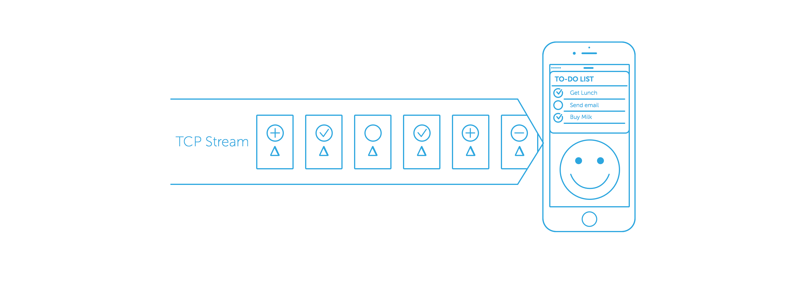

# Stream Based Data Synchronization (working title)

_Still a work in progress_

## 1. Introduction

### 1.1 Who Am I, What I Do?

I'm the lead iOS engineer at Layer, primarily working on the messaging SDK,
which mostly consists of multiple layers of data synchronization. I started
working on various data synchronization approaches at the early stage of
the company and there has been many prototypes built across the platform,
Android and iOS.

## 2. Data Synchronization

### 2.1 What is Data Synchronization?

Term _synchronization_ in computer science is a bit ambiguous, it can for
example mean coordination of simultaneous processes to complete a task in
the correct order (to avoid any potential race conditions). But in this topic
we'll be mainly talking about data synchronization, as in having the
same state across multiple clients.

#### 2.1.1 Example

An example would be a mobile app with a toggle switch, say a **light switch**.
Now, if I have 5 devices in front of me, I'd like to have the light switch
state shared across all those devices. If I turn the lights on or off
one device, it should reflect the changes on other 4 devices. That's a
pretty basic example of data synchronization over network.


Solutions for such problem come pretty natural to experienced engineers, but
for some it may not be as trivial. So let's play with the _Light Switch_
sample app idea for a little. To narrow down the requirements for this app,
let's say that the light switch state has to be shared across devices
via TCP/IP network. I pointed out TCP/IP network because there are also other
technologies and protocols we could use which provide close proximity
communication to achieve this (such as Bluetooth, AdHoc WiFi,
Multi-peer Connectivity on Apple devices, etc.).

#### 2.1.2 How Would We Design Such a System?

Let's make a list of components we need to have to achieve this:

- **a simple server** -- which can be a lightweight service (process)
  written in C using standard library, or something written in higher-level
  languages (Scala, Ruby, Python, Java, etc.) using off-the-shelf libraries.
  For the sake of simplicity, we'll use a simple web socket server in
  Ruby that accepts a JSON structure from clients with _Light Switch_
  state information, and fans out the new state to other clients.
  No persistence of the _Light Swtich_ state is required.

- **mobile clients** -- an app that connects to our lightweight server
  capable of receiving and sending _Light Switch_ state changes through
  the web socket. For visualization of these state changes we'll switch
  between two different background images (one indicating lights are on,
  and the other one for when the switch is off).


{ fig.2 - draw the light switch architecture, that has a server and a client
being connected with a two-way arrow and a JSON structure floating between
them }

Both client side and server side code should be very simple to implement.

#### 2.1.3 Client Side

Let's check the client side code first. We mentioned we're going to use
[WebSockets](https://en.wikipedia.org/wiki/WebSocket) to keep a persistent
connection between the client and the server. For me the one that kind of sticks
out is [Starscream](https://github.com/daltoniam/Starscream), it's a clean,
very easy to use WebSocket client written in Swift.

We shouldn't need more than two functions to do the job of sending and
receiving Light Switch state updates in our transport layer.

```swift
/**
 Transmits the light switch state to the server

 - Parameter lightsOn: A boolean value representing the light switch state.
 */
public func sendLightSwitchState(lightsOn: Bool) {
    let lightSwitchStateDict = ["lightsOn" : lightsOn]
    var JSONString: String?
    do {
        let JSONData = try NSJSONSerialization.dataWithJSONObject(lightSwitchStateDict, options: NSJSONWritingOptions.PrettyPrinted)
        JSONString = String(data: JSONData, encoding: NSUTF8StringEncoding)!
    } catch let error {
        print("Failed serializing dictionary to a JSON object with \(error)")
    }
    if JSONString != nil {
        self.webSocketClient.writeString(JSONString!)
    }
}
```

What the function above does is it wraps the `Boolean` value into a dictionary,
serializes it into a JSON structure (which is a `String`) and then sends
it over the open Web Socket connection.

Now we need a function to do the similar operation on the inbound side.
In an event of receiving a JSON structure, it should try deserializing it
into a dictionary object and call a delegate method to let it know of the new
Light Switch state.

```swift
/**
 WebSocket's delegate method invoked by the `WebSocket` client upon
 receiving a string body.

 - Parameter socket: A `WebSocket` client performing the call on the method.
 - Parameter text: The text body received by the `WebSocket` client.
 */
public func websocketDidReceiveMessage(socket: WebSocket, text: String) {
    let JSONData = text.dataUsingEncoding(NSUTF8StringEncoding)
    var lightSwitchStateDict: Dictionary<String, AnyObject>?
    do {
        lightSwitchStateDict = try NSJSONSerialization.JSONObjectWithData(JSONData!, options: NSJSONReadingOptions.AllowFragments) as? Dictionary<String, AnyObject>
    } catch let error {
        print("Failed deserializing the JSON object with \(error)")
    }
    if lightSwitchStateDict != nil {
        self.delegate?.lightSwitchClientDidReceiveChange(self, lightsOn: lightSwitchStateDict?["lightsOn"] as! Bool)
    }
}
```

The UI controller implementation should be symmetrical to the transport
layer implementation. Again, two functions -- one sending the controller's
Light Switch state to the transport layer whenever user taps on the button,
and the other one should be an implementation of the delegate
callback which the transport layer calls, which toggles the switch in the UI.

```swift
/// The local Light Switch state.
private var lightSwitchState:Boolean;

/**
 LightSwitchClientDelegate function implementation, which gets executed
 whenever a new light switch state comes in from the network. The new state
 gets stored in a local variable `self.lightSwitchState`.

 - Parameter client: The `LightSwitchClient` executing the function.
 - Parameter lightsOn: The new Light Switch state coming from network.
 */
func lightSwitchClientDidReceiveChange(client: LightSwitchClient, lightsOn: Bool) {
    self.lightSwitchState = lightsOn
}

/**
 Toggles the private ivar `_lightSwitchState` boolean, updates the
 background image, plays a sound and transmits the change over network.
 */
func toggleAndSendLightSwitchState() {
    self.lightSwitchState = !self.lightSwitchState
    self.lightSwitchClient?.sendLightSwitchState(self.lightSwitchState)
}
```

This pretty much sums up the client side implementation.

#### 2.1.4 Server Side

Let's take a quick look at how the server-side implementation should look
like. I chose to write the server side implementation in Ruby
using a library called [em-websocket](https://github.com/igrigorik/em-websocket).

```ruby
# A global variable keeping the light switch state.
@lightSwitchState = false;

# Global channel instance available across all web socket connections. We'll
# use this channel to emit the changes to all open connections.
@channel = EM::Channel.new

EM::WebSocket.run(:host => "0.0.0.0", :port => 8080) do |ws|
  ws.onopen { |handshake|
    # Sending the last known lightSwitchState to the newly connected client.
    # JSON Structure example: { lightsOn: true }
    ws.send ({ :lightsOn => @lightSwitchState }.to_json)

    sid = @channel.subscribe { |msg|
        # Sends a text body over the web socket to the connected client.
        ws.send msg
    }

    ws.onmessage { |msg|
      lightsOn = JSON.parse(msg)
      @lightSwitchState = lightsOn["lightsOn"]
      # Pushing the new reconstructed JSON structure.
      @channel.push { :lightsOn => @lightSwitchState }.to_json
    }
 }
end
```

There's two main parts to the code above. We used channels to construct
a notion of followers (or subscribers, if you will), and when a client
connects to the server it gets added to the channel (`@channel.subscribe`).
Then, as soon as the server receives a light switch change (`ws.onmessage`)
from a client, it unwraps the JSON structure, takes out the Light Switch state
(`:lightsOn`), stores it into the globally variable (`@lightSwithcState`) and
then pushes a newly constructed JSON object to the channel, which then
gets emitted to all of the channel participants. This is how we
achieve the fan-out.

So there you go, a pretty basic approach to data synchronization.

### 2.2 Other Use Cases

In our example (chapter 2.1.1) we demonstrated how to synchronize an ON/OFF
switch across multiple devices -- it's not a common use case, but it was good
enough to prove a point.

There are a lot of applications we use every day that use data synchronization
to share the same state across devices, let's identify a few with examples:

- **e-mail** -- most IMAP clients get up to date by fully synchronizing the
  list of all e-mails and their unread state. All clients for the same
  user receive new messages at the same time; marking a message on one client
  as read reflects the change on other clients as well.
- **messaging** -- having the same view of messages and conversations
  across clients; web, mobile, etc. Receiving messages and their delivery
  and read receipts from other participants on all the clients.
- **photo sharing** -- shared photo stream with all subscribers.
- **file sharing** -- backing up a content of a folder from local filesystem
  to cloud.
- online **text** and **spreadsheet editors** -- having multiple users
  editing the same text or spreadsheet document at the same time. Seeing
  the text coming in as users type in different paragraphs.
- **multiplayer games** -- same state of the world for all players on the
  same server. Things as trivial as picking up ammo or weapons from the ground,
  etc.

The list goes on...

### 2.3 Types of Data Synchronization

Now that we had identified a few of these use cases, let's figure out
what kind of data we even deal with in those cases.

We mentioned **file sharing** -- that means file content and directory structure
replication across clients. If I add a file to the _shared_ folder on one
of my computers, I'd like that file to appear on other computer too. Same if
I modify that file on one computer, I want that file along with its content
to be copied to other machines too. The easiest way to implement this would
be to copy the whole directory (along with all the files and sub-directories)
every time we change something (add or remove a file, change the content in
a file). This would work, but that simply does not scale. If I keep adding
files to the directory, the copy process would become longer with the count
of files.

Better way to synchronize a file / directory structure is to compare them,
recognize differences and only copy what doesn't match. This is what we call
[file-synchronization](https://en.wikipedia.org/wiki/File_synchronization),
[Rsync](https://en.wikipedia.org/wiki/Rsync) is a very nice example of this.
It's similar to how [Dropbox](https://en.wikipedia.org/wiki/Dropbox_(service)),
[iCloud Drive](https://en.wikipedia.org/wiki/ICloud#iCloud_Drive) and all
these file hosting solutions minimize the work in order to get the files
in sync with all machines.


Copying file's content over to other clients **every time** we touch it on one
machine can be a rather expensive operation -- well, it depends on the size
and type of the content -- but let's say we're dealing with a multiline text
document, a source code file for example. Why copy 10 kilobytes of content,
represented by hundreds of lines of code, where we just wanted to change
a single line of code:

```swift
    83: //
    84: // Toggles the private ivar `_lightSwitchState` boolean, updates the
    85: // background image, plays a sound and transmits the change over network.
    86: //
    87: func toggleAndSendLightSwitchState() {
    88:     self.lightSwitchState = !self.lightSwitchState
>   89:     self.lightSwitchClient.sendLightSwitchState(self.lightSwitchState)
    90: }
```

In above example, I forgot to specify optional chaining in the line `89:`.
That is just a single line of change. One way of describing this content
change could be through the
[unified diff annotation](https://en.wikipedia.org/wiki/Diff_utility), which is
still lighter than copying the whole file over.

```patch
--- 89:     self.lightSwitchClient.sendLightSwitchState(self.lightSwitchState)
+++ 89:     self.lightSwitchClient?.sendLightSwitchState(self.lightSwitchState)
```

Due to the nature of the document's data structure (lines of text separated by
newline characters `\0x0a`), this was fairly easy.
That's how [distributed revision control systems](https://en.wikipedia.org/wiki/Distributed_version_control)
describe and apply changes to text files. But at the end of the day,
we **synchronized document's content** change.

What about our _Light Switch_ app example (from chapter 2.1.1)? It's nothing
more than **data-model synchronization**.


{ fig.4 - draw the light switch JSON structure (as text) being duplicated
with a mouse cursor having a (+) icon with it }

As with file and document synchronization, we can just make a copy
of the data-model and transfer it over the wire to other
clients, which is exactly what we did in our example app. We could afford
this in our _Light Switch_ example app, seeing that the model was
extremely small -- it's a single instance of a boolean value
`private var lightSwitchState:Boolean;`, you can't get smaller than that.

Should the model be more sophisticated (having multiple fields, mutable
collections, relationships with other structures), copying the whole structure
along with its values (whole object graph) over and over again becomes
expensive.

### 2.4 Approaches to Data Synchronization

What we've learned from the previous chapter is, that there are different
ways to get our data up-to-date. The most naive way is to just **copy it**,
which in a lot of cases, is less than ideal. Better way to get the existing
data up-to-date is to only **apply changes** to it. Let's visit
both approaches.

#### 2.4.1 Absolute Synchronization (copying)

**Copying** and replacing the data (file, document, data-model) is perfectly
fine, when we don't care for the amount of data we need to transfer, since
the server will always return a fully populated dataset. Also works good when
the synchronization is uni-directional, meaning the client
always asks the server for the source of truth (e.g. refreshing the
weekly weather forecast, or refreshing a list of RSVPs).

The other drawback of copy based synchronization for clients is not only
the potential higher bandwidth cost due to transmitting the same data
for the most part (which we call data redundancy), but also if we
need to be aware of the changes when replacing our old dataset with
the newly up-to-date one, we'd need to compare (differentiate) the two
datasets first, before replacing the old one. That process burns twice
as much memory (since you need to hold both sets in memory) and CPU time
for as much as there are elements in both sets (which gives us the O(n ⋁ m)).


{ fig.5 - draw a filled out exam with ABCD answers, a stencil with
correct answers, resulting in a exam with incorrect answers crossed }

Suppose you're invited to a dinner party and you ask the receptionist
_"Who's here?"_. That person will respond: _"There's Alex, Blake, Caroline,
Dan, Emily and George."_. In your mind you've made a list of guests from what
you just heard. Now one of the guests leaves, but you weren't paying
attention, so you go ask the receptionist, _"What about now?"_, and the
person responds: _"There's Alex, Caroline, Dan, Emily and George"_ -- it's
like talking to an idiot. So in order to figure out what has changed, if
anyone left or someone new joined the party, you'd need to remember the
list of guests from before and run it against the one you just heard, and
check for differences.

#### 2.4.2 Relative Synchronization (based on changes)

You'd be better off with an answer like: _"Blake just left"_, instead of
listening the person go through the whole list of people that are still
at the party. That's assuming the person you're asking knew when was
the last time you were paying attention. It just seems like a lot of
work for the receptionist to keep track of what others take notice off.
So, to make it a little easier you should rephrase the question to: _"What has
happened after I arrived?"_.


{ fig.6 - draw a list of records of guests coming in and out with timestamps }

The receptionist would just go through the list where he keeps the names
of the guests joining and leaving the party, look for the record when you
arrived and narrate all the events that happened after that.

That is an example, when you update data only with small differences, based
on previous events that you're already familiar with, to avoid copying
the whole data set. These small differences or **changes** are also known
as deltas.

### 2.5 What are Deltas?

Delta encoding is a way to describe differences between two datasets
(file, document, data-model, etc.). We can use these short pieces of
information to apply onto our dataset (in form of mutations) to
get it up-to-date and from what we've just learned, is that it can
significantly reduce the data redundancy in synchronization processes.


{ fig.7 - draw a 16x16 pixel face with mouth missing, and a smile representing
a delta }

#### 2.5.1 How to Encode Deltas?

Of course, depending on our application, we'd want to encode the deltas
in the way that is suitable for our application data model. Taking a look
at the few examples we've set out in **chapter 2.3**, applications can
work with pure arbitrary data (binary files), document (text files, xml,
spread sheets), data-model (data structures), etc.

But generally, we'd want our deltas to give us instructions on how to
modify our old data set, so that it will match the new one, based on three
simple operation types:

- **insert** -- adds new values to our data set
- **update** -- updates existing values in our data set
- **delete** -- deletes existing values from our data set

If you remember **chapter 2.3** already demonstrated one of the delta encoding
approaches suitable for text changes -- it was the example, where we had to
change a single line of text in a multi-line text file (swift source code).
How do we deal with other kinds of data structures? Let's got over
a couple:

##### Delta Encoding Example of Binary Data

Given a file of arbitrary data (of 80 bytes):

```hexdump
0000000: 4749 4654 2B31 0d00 0d00 9100 00b6 6257  GIFT+1........bW
0000010: 0804 0456 2c27 e5aa 7f21 f904 0000 0000  ...V,'...!......
0000020: 002c 0000 0000 0d00 0d00 0002 318c 8f29  .,..........1..)
0000030: 3000 7986 944f 8823 260d 0feb b620 0b03  0.y..O.#&.... ..
0000040: 2e97 e1a4 0f79 920c 60a5 28e5 c452 abc6  .....y..`.(..R..
```

we'd like to change the value of tree bytes starting at offset `0x03`,
and append 16 more bytes at the end of the array. We could encode the
delta as:

```javascript
[
  {
    type: "update",
    offset: 0x03,
    values: [ 0x38, 0x39, 0x61 ]
  }, {
    type: "insert",
    offset: 0x50,
    values: [ 0xCE, 0xE1, 0x50, 0x96, 0x89, 0x48, 0x9D, 0x02, 0x43, 0x62,
      0x8D, 0x98, 0x28, 0x00, 0x00, 0x3B ]
  }
]
```

_**Note**_ that I chose to describe the data structure above using a
JSON format. We can serialize the delta information in any format
that suits the purpose. Here are a few from the top of my head:
[Thrift](https://en.wikipedia.org/wiki/Apache_Thrift),
[Protobuff](https://en.wikipedia.org/wiki/Protocol_Buffers),
[CapnProto](https://github.com/sandstorm-io/capnproto), however you can chose
to implement your own proprietary serialization protocol.

We could use the exact same delta encoding approach to describe a change in
a text file -- if we bring the example from **chapter 2.3** to mind, the one
where we used the unified diff patch to update a single line of code.

```patch
--- 89:     self.lightSwitchClient.sendLightSwitchState(self.lightSwitchState)
+++ 89:     self.lightSwitchClient?.sendLightSwitchState(self.lightSwitchState)
```

Don't be mistaken, the unified diff patch is still a _delta_, encoded
differently though, but we could get rid of both, the before and after values
(the lines that start with `---` and `+++`) in favor of inserting a single
character at the right location, which gives us the same result:

```javascript
{
  type: "insert",
  offset: 2781,
  values: [ "?" ]
}
```

##### Delta Encoding Example of a Custom Data Model

Back to our guest list from the previous **chapter 2.4**. Client's data model
shouldn't be more than just a set containing the names of the guests that are
present at the party. Based on the first response from the receptionist,
the set would contain the following names:

```javascript
{
  guests: [ "Alex", "Blake", "Caroline", "Dan", "Emily", "George" ]
}
```

Asking the recipient for any changes that have occurred after a certain
period, the response would contain an encoded delta telling the client
to remove _"Blake"_ from its set.

```javascript
{
  type: "delete",
  guest: [ "Blake" ]
}
```

When applying the delta onto our model, the dataset should contain following
names:

```javascript
{
  guests: [ "Alex", "Caroline", "Dan", "Emily", "George" ]
}
```

## 3. Stream Based Synchronization

There are plenty of approaches to get our data model synchronized with the
server, we'll be taking a closer look at the synchronization approach that
takes the advantage of persistent streams. Now, before we dwell on what stream
based synchronization is and how we can leverage it, I'd like to
discuss the motivation behind it -- specify the requirements, if you will.

### 3.1 The Motivation

In most cases, developers want to solve the synchronization of shared
data model between clients and the server with **minimum data redundancy**.
This not only lowers the storage and bandwidth costs of a hosted system,
but also saves CPU time. We already discussed this a little in
**chapter 2.4.1 -- Absolute Synchronization**, and **chapter 2.5 --
What are Deltas?**.


{ fig.8 - draw a comparison of a system with 5 users each having his own sheet of paper,
and a system with 5 users sharing a single sheet of paper; first system
covered in a cross mark, the other one with a check mark }

One of the important requirements to most folks is also **speed**. How fast
we can get a user action delivered to the server -- by _"user action"_, I mean
a mutation that a user caused to his data model that needs to be distributed
across other devices. So in other words, get the deltas off of the
clients, onto the server and back to other users' devices
as quick as possible.


{ fig.9 - picture five mobile phones all connected to a server, and one
of the devices is sending a short piece of information }

Another key thing is having short and fast writes on the server, which lowers
the response time of a client's request and also reduces the load on
the system -- all these things aim toward **good concurrency characteristics**.


{ fig.10 - sketch a path to the database with 5 lanes merging into one, with
long marks in lanes indicating writes to database; then another diagram with
shorter marks in the lanes, indicating shorter writes }

Lastly, a very important aspect to system design is **scalability**.
A system can grow with the number of users it serves, as does with
the amount of the content generated its by users. So when modeling
the data structures (schema), we must also account for data distribution
and replication, which should be easy and painless. Having a distributable
system not only provides fail safety -- in case of outages and data
corruption -- but it also makes it easy to employ load balancing approaches.


{ fig.11 - sketch a database cluster ring with a few services connected
to them, where one of the services is dead, and a few clients connected
to services. }

A feature we tend to forget about is also **offline support**.
Synchronization logic should not prevent the application logic from operating
autonomously. Your synchronized photo library (camera roll) is accessible on
all your mobile device. Imagine if you couldn't take photos, edit or
remove them from your library, when you're out of the network conectivity?


{ fig.12 - A globe with a giant cross mark over it }

### 3.2 Stream of Events

Finally, we get to talk about stream based synchronization. Remember how
we synchronize our _Light Switch_ apps in **chapter 2.1**? Clients have a
bi-directional TCP connection to the server, and every time a user flips
the switch, that change -- the mutation on the model -- is sent to the
server that distributes the change to other clients.

Put differently, clients with an open connection to the server are receiving
a **stream** of live **events** -- events that describe the changes to the
model. As long as the clients retain the connection with the server, their
model will be up-to-date.


{ fig.13 - a tape of events having "ON" and "OFF" values and a phone at
the end with a happy face 😁 on the screen and a lit lightbulb }

Cold _Light Switch_ clients, those are the clients that have never been
synced with the server, will get updated as soon as they establish
a connection and receive their first event. We had already learned, this
argument is true because our _Light Switch_ data structure is very light.
It only shares a single primitive value, a scalar, or more specifically,
a `boolean` state -- is the switch turned _ON_ or _OFF_. Encoded delta
for a scalar property by it self represents a new value, you don't need
the previous state of that property where you'd apply the delta onto, to get
it to a true up-to-date state.

But, imagine a data structure for an app that operates on a little more
advanced data model, and since we're in the spirit of exercising our theory
knowledge on examples, let's try it on a different kind of application.
Let's build a _To-do List_ app!


{ fig.14 - an isometric phone in someone's hand with a few checklist items
on the screen; some checked, some left un-checked }

#### 3.2.1 Example (To-do List App Data-model)

Let's write down use cases and support them with a data model:

1. Application provides a live synchronized list of to-do tasks;

    ```swift
    public struct Todo {
        public class List: NSObject {
            /// A private collection of tasks maintained by this class.
            private let tasks: Array<Task> = []
        }
    }
    ```

2. A task element contains:
    - A `true` or `false` value indicating it's been marked as complete;
    - It also contains a `string` description of the task;
    - And a numeric value annotating a color coded label (0 = black, 1 = red,
      2 = orange, 3 = yellow, etc.)

    ```swift
    public struct Todo {
        public class Task: NSObject {
            /// Client generated identifier, used for referencing and de-duplication.
            public private(set) var identifier: NSUUID
            /// Boolean state indicating the completion of the task.
            public private(set) var completed: Bool
            /// Text description of the task.
            public private(set) var title: String
            /// Color coded label of the task.
            public private(set) var label: ColorLabel

            public enum ColorLabel: UInt8 {
                case None = 0, Red, Orange, Yellow, Green, Turquoise, Blue, Purple, Pink
            }
        }
    }
    ```

3. Tasks can be added to the list, edited or removed from the list;

    ```swift
    public struct Todo {
        public class List: NSObject {
            /// A private collection of tasks maintained by this class.
            private let tasks: Array<Task> = []

            /// Method for manipulating the to-do list.
            public func create(title: String, label: Task.ColorLabel)
            public func update(identifier: NSUUID, completed: Bool?, title: String?, label: Task.ColorLabel?)
            public func remove(identifier: NSUUID)
        }
    }
    ```

These three methods should be enough to operate a list of tasks on the client.
They support all user actions we care for:

- [x] creating and inserting a new task to the end of the list;
- [x] editing an existing task with new a new completion state, task description,
  or a new color coded label;
- [x] deleting an existing task from the list;

#### 3.2.2 Example (To-do List Sync Data-model)

So how do we describe these user actions, so that we can transmit them
over the network? User actions cause mutations to our model (which are
`Todo.Task` and `Todo.List`), and we need to encode these mutations as
deltas. Well, I prefer to use the word `Sync.Event` to symbolize an action.

How would an event structure look like in our code? It is pretty close to
the `Todo.Task` model. Also keep in mind that objects we want to use in our
synchronization logic should be simple concrete objects conforming to some
serializable and de-serializable protocol (of your choice), since we'll be
transmitting them over the network.

```swift
public struct Sync {
  public class Event: NSObject {
      /// Event type describing a mutation on the model.     
      public enum Type: UInt8 {
          case Insert = 0, Update, Delete
      }

      public private(set) var type: Type
      public private(set) var identifier: NSUUID?
      public private(set) var completed: Bool?
      public private(set) var title: String?
      public private(set) var label: Int?
  }
}
```

You might be wondering, why couldn't we just use or extend the existing
model (`Todo.Task`), since they are pretty much symmetrical? It's because
we'll need a little more data that will help us at the sync process, but
we'll get to that later.

So, if a user creates a new task in the app, app will emit an `Sync.Event` over
the network. _Note: again, I'm going to use JSON-like notation to describe
objects with values_.


{ fig.15 - an isometric phone in someone's hand and a thumb tapping on the (+)
icon next to an item with a text spelling "Buy milk" }

```javascript
{ // event structure
  type: 0,                                              // 0 = Insert
  identifier: "cb55ceec-b9ae-4bd9-8783-7dbf3e9cb2cd",   // client generated id
  completed: false,                                     // an incomplete task
  title: "Buy milk",                                    // task description
  label: 0                                              // task without a label
}
```

If a user marks the task as completed, app will generate and emit an
event looking like so:


{ fig.16 - an isometric phone in someone's hand and a thumb tapping on the
checkmark next to the item }

```javascript
{ // event structure
  type: 1,                                              // 1 = Update
  identifier: "cb55ceec-b9ae-4bd9-8783-7dbf3e9cb2cd",   // task's identifier from before
  completed: true                                       // new value
}
```

### 3.3 Let the Streaming Begin

We now have an idea, how events transmitted on a stream look like. Client
generating the events sends them to the server, then server's responsibility
is to broadcast those exact changes to other peers. These events are
received by all active clients, and as long as the clients are
connected to the server, they are going to have a consistent dataset.



{ fig.17 - a tape of to-do item mutations with a phone having a smily face
on the screen and a few checked items below }

However, if a client comes online a few moments later, it might've missed
events which are important to reconstruct the dataset. What good is
an `Sync.Event` telling that a task was completed to a client that never saw
the original task to begin with?


{ fig.18 - a tape of to-do item mutations with a phone having a puzzled
face 🤔 and a checkmark next to "?????????????" }

Such client is considered _"out-of-sync"_.

### 3.4 Persistent Stream

Don't worry, having clients being wedged in an _out-of-sync_ state is
recoverable. One way, of bringing an out-of-sync client back to a consistent
state would be to replay all the events, that have happened while the client
was away. Which means that the server's responsibility besides broadcasting
the events should also be recording all the events that come in. In other
words, we need to persist the _stream of events_.

We can think of a persistent stream as a linear magnetic tape, a storage
with [WORM](https://en.wikipedia.org/wiki/Write_once_read_many) behavior.
It's where we're only allowed to append the events at the end, and we can't
mutate any of the existing events once they have been written down.


{ fig.19 - draw a tape of events hold together by two reels }

A lot of distributed databases are married to this idea, their performance is
better, when you don't mutate existing records. In the
[NoSQL](https://en.wikipedia.org/wiki/NoSQL) world, more specifically
in column-oriented databases, data structure is (naively) considered as
a table with ever growing rows. Unfortunately our data might not
be replicated in the same manner across all distributed database nodes and
clusters -- there's no way to guarantee the same order in them as values
get written, this is due to the concept known as
[eventual consistency](https://en.wikipedia.org/wiki/Eventual_consistency).

Asking an eventually consistent database for a record based on an offset
inside its row might yield a different answer, depending which database node
or cluster you end up talking to. That's why you ask for the records based
on their values, and you can decide which values you want indexed as
records get written. But still, eventually consistent database cluster
cannot guarantee it will yield the same or any result when asking it
for a record based on certain key, since the record might've not been written
nor indexed yet.

In our _To-do List_ app example, we gave our `Todo.Task` objects their
own `identifiers`, client generated
[UUIDs](https://en.wikipedia.org/wiki/Universally_unique_identifier).
This let's us reference `Todo.Tasks` in `Sync.Events` when applying mutations
onto to model. These identifiers could also be useful to fetch all
`Sync.Events` representing the final state of a `Todo.Task` from the database,
if database kept an index of these identifier values. But as we figured out,
in certain edge cases (due to eventual consistency), a replicated database
cluster might return a different result set from another.

So, how does a client know for sure it's got all the events? If you remember,
one way is to always copy the whole dataset (absolute sync, **chapter 2.4.1**).
Or we could implement some sort of integrity check, that would calculate
a hash based on Events' values. But still, that would only indicate there's
a mismatch between our datasets, we'd still need to copy the whole set.
Sure, we could order and section our dataset based on a key, and hash each
section individually, but let's be honest, we'd still be calculating and
transferring a lot more data, than it's truly necessary.

### 3.5 Event Discovery

This is where sequencing comes in handy. Giving an `Sync.Event` a unique
server-generated cardinal value, we could leverage it as a
lightweight index to our events. In math, this is also called a countable
ordered index set, where the value of n-th element is equal to its zero
based index n. The maximum value which is also the value of the last
element in such index set denotes its size (the count of elements).

Let's extend our `Sync.Event` model with a new property called `seq`:

```swift
public struct Sync {
    public class Event: NSObject {
        /// Event type describing a mutation on the model.     
        public enum Type: UInt8 {
            case Insert = 0, Update, Delete
        }

        public private(set) var seq: Int? // server generated index value
        public private(set) var type: Type
        public private(set) var identifier: NSUUID?
        public private(set) var completed: Bool?
        public private(set) var title: String?
        public private(set) var label: Int?
    }
}
```

As clients generate and upload `Sync.Events`, server picks them up, assigns
them a sequence value and persists them to storage. With every event written to
storage, sequence value is incremented. First event written to the stream has a
sequence value of `seq: 0`, second one get the value of `seq: 1`, etc. You
get the idea how incrementing integers goes. And yes, the work of assigning
sequence values can be put off on the database, if the database supports
auto incremented record sequencing.

For a recently online client to figure out which events it might've missed,
a basic inquiry of "what's the last sequence value written to the stream?"
is enough. With the server response client takes the number and stores it.
The best place to store it would be in an object, where we'd keep all
information associated with a stream. For now, we're only interested in
what is the most recent event's `seq` value written to the stream:

```swift
public struct Sync {
  public class Stream: NSObject {
      /// Last known sequence value received from the server.
      public private(set) var latestSeq: Int = 0

      /// A method that talks to the transport layer and in
      /// in charge of publishing the `Sync.Events` onto the network stream.
      public func publish(event: Event) -> Bool
  }
}
```

With that information, a client can run through a list of `seq` values of
the events it's got on itself from before, and diff it against a set of
integers going from zero `0` to whatever the number of events server
told us it has. Now client knows exactly which events it needs to pull
from the server (based on a _diffed_ set of `seq`) in order to
get to a consistent state with other peers.


{ fig.20 - draw two streams (tapes), a server stream and a client stream;
server stream has all events in the stream, whereas client has a hole
for the period when it was offline }

What better way to test this theory, than through an example, huh? Say we've
got a few clients connected to the server, and server's stream is
completely empty. I'm going to numerate the steps in this example, because
I'll be reference them.

1.  Through the use of the _To-do List_ app, clients have generated `10` events.
    All these connected clients were fortunate to receive the `Sync.Events` as
    they got published to the stream in real-time.

    ```javascript
    // Sequence values of all the Events written to the stream
    // and received by all the clients.
    [ 0, 1, 2, 3, 4, 5, 6, 7, 8, 9 ]
    latestSeq = 9
    ```

2.  One of the clients went offline (due to either poor connectivity, or
    because, the user decided to put the app away).

3.  Meanwhile, other clients have generated and published `5` more events to
    the stream.

    ```javascript
    // Sequence values of all the Events written to the stream.
    [ 0, 1, 2, 3, 4, 5, 6, 7, 8, 9, 10, 11, 12, 13, 14 ]
    latestSeq = 14
    ```

4.  The offline client (from 2. step) comes back online, when `5` more events
    get published. This now makes it a total of `20` events.

    ```javascript
    // Sequence values of all the Events written to the stream.
    [ 0, 1, 2, 3, 4, 5, 6, 7, 8, 9, 10, 11, 12, 13, 14, 15, 16, 17, 18, 19 ]
    latestSeq = 19
    ```

5.  The same client, that's been offline for a while has got a few events
    missing:

    ```javascript
    // `seq` values from the recently connected client's perspective.
    [ 0, 1, 2, 3, 4, 5, 6, 7, 8, 9, __, __, __, __, __, 15, 16, 17, 18, 19 ]
    latestSeq = 19
    ```

    We described such client as being in an _out-of-sync_ state. It's got a few
    `Sync.Events` that don't mean anything without their predecessors.

6.  Client creates a set of `seq` values from all the events it has and
    subtracts it with a set of integers ranging from `0` to `19`. Which results
    in a following set of integers:

    ```swift
    // Seq values pulled from all events the client has.
    // [ 0, 1, 2, 3, 4, 5, 6, 7, 8, 9, 15, 16, 17, 18, 19 ]
    let seqsOfEvents: Set = events.map({ $0.seq })

    // Calculated sequence ranging from 0 to 19.
    // [ 0, 1, 2, 3 ... 19 ]
    let seqsOfAllEvents: Set = [Int](0...19)

    // Diffed set of seq values.
    // [ 10, 11, 12, 13, 14 ]
    let seqsOfMissingEvents: Set = seqOfAllEvents.subtract(seqOfEvents)
    ```

    Note: _working with [NSIndexSet](https://developer.apple.com/library/mac/documentation/Cocoa/Reference/Foundation/Classes/NSIndexSet_Class/)
    would be far more efficient, but I wanted to use classic sets for the
    sake of simplicity._

7. With the set of `seq` annotating the missing events, client asks the
   server to hand out these events, which brings the client back to a
   consistent state.

## 4. Event and Model Reconciliation

By now, we've answered the question on how to design our application data
model (`Todo.List`, `Todo.Tasks`), how to design the synchronization model
(`Sync.Stream` and `Sync.Events`), we also know how to discover new events
in case we missed some (based on `stream.latestSeq` and
  `Sync.Event.map({ $0.seq })`).

But we never asked which part of the client side code is actually responsible
for vending these `Sync.Events`, nor how do we turn incoming `Sync.Events`
back to our objects.

### 4.1 Outbound Reconciliation

If we have to pick a name for this process of turning model mutations into
synchronize-able (syncable for short) `Sync.Events`, let's call it
_"Outbund Reconciliation"_.


{ fig.21 - a list of todo items on the left with an arrow pointing to
events on the center and another arrow pointing at the stream on the right}

One of the spots to put the `Sync.Event` creation logic is where we take the user
actions, in the heart of our application's logic -- that's in the to-do
`Todo.List` class. In our case, this is really affordable, because the
`Sync.Event` model can hold the exact information to describe user actions
the `Todo.List` logic provides. If you take a close look at the `Todo.List`
instance methods and the `Sync.Event` model, you'll find some resemblance.
`Sync.Event.type` defines the method calls, and the rest of `Sync.Event's`
properties define the arguments we pass into the methods.


{ fig.22 - a screenshot of `Todo.List` and `Sync.Event` class definition
  with arrows pointing out similarities }

```swift
public class List: NSObject {
    public func create(title: String, label: Task.ColorLabel) -> Sync.Event {
        let task = Task(identifier: NSUUID(), completed: false, title: title, label: label)
        self.tasks.append(task)
        return Sync.Event(insert: task.identifier, completed: task.completed, title: task.title, label: task.label.rawValue)
    }

    public func update(identifier: NSUUID, completed: Bool?, title: String?, label: Task.ColorLabel?) -> Sync.Event? {
        let task = self.task(identifier)
        if task == nil {
            return nil
        }
        task!.update(completed, title: title, label: label)
        return Sync.Event(update: identifier, completed: completed, title: title, label: label != nil ? label!.rawValue : nil as UInt8?)
    }

    public func remove(identifier: NSUUID) -> Sync.Event? {
        if !self.removeTask(identifier) {
            return nil
        }
        return Sync.Event(delete: identifier)
    }
}
```

Let's see how these methods play out:

#### Creating Todo.Tasks

Telling the to-do `Todo.List` object to create and put a new `Todo.Task` on
list will now also vend an `Sync.Event`:

```swift
let todoList = List()
let event = todoList.create("Buy Milk", label: Task.ColorLabel.None)
print("event: '\(event)", event)

// event: {
//   type: 0,                                              // 0 = Insert
//   identifier: "cb55ceec-b9ae-4bd9-8783-7dbf3e9cb2cd",   // client generated id
//   completed: false,                                     // an incomplete task
//   title: "Buy milk",                                    // task description
//   label: 0                                              // task without a label
// }
```

#### Updating Todo.Tasks

Invoking the `update(identifier:completed:title:label:)` method on `Todo.List`
instance will give us an `Sync.Event` of type `update`:

```swift
let task = todoList[0]; // returns first task in the list
let event = todoList.update(task.identifier, completed: true, title: nil, label: nil)
print("event: '\(event)", event)

// event: {
//   type: 1,                                              // 1 = Update
//   identifier: "cb55ceec-b9ae-4bd9-8783-7dbf3e9cb2cd",   // task's identifier from before
//   completed: true                                       // new value
// }
```

#### Removing Todo.Tasks

And removing a task from a `Todo.List` is no different:

```swift
let task = todoList[0]; // returns first task in the list
let event = todoList.remove(task.identifier)
print("event: '\(event)", event)

// event: {
//   type: 2,                                              // 2 = Delete
//   identifier: "cb55ceec-b9ae-4bd9-8783-7dbf3e9cb2cd",   // task's identifier from before
// }
```

#### Publishing Sync.Events

And this is how we turn model mutation into events. The only thing that's left
for these `Sync.Events` is shipping them off to the server and on to the
stream, so that the other clients can receive them.

```swift
// Sends the event to the stream over the network.
self.stream.publish(event)
```

### 4.2 Inbound Reconciliation

What do other clients do with `Sync.Events`, once they receive them from
the server? These `Sync.Events` have to be turned back into object. It's a
process we can name _"Inbound Reconciliation"_.


{ fig.23 - same as figure 20. but mirrored; server on the left, sending events
drawn in the middle, turning into a checklist }

As with the _Outbound Reconciliation_ logic, described in **chapter 4.1**,
_Inbound Reconciliation_ logic can reside in the to-do `Todo.List` class.

```swift
public class List: NSObject {
    public func create(title: String, label: Task.ColorLabel) -> Sync.Event
    public func update(identifier: NSUUID, completed: Bool?, title: String?, label: Task.ColorLabel?) -> Sync.Event?
    public func remove(identifier: NSUUID) -> Sync.Event?

    public func apply(event: Event) {
        // implement event reconciling logic here
    }
}
```

We've made a little mess here, haven't we? By adding the extra logic of
vending `Sync.Events` to the `Todo.List` manipulation logic in **chapter 4.1**,
we're not sure anymore which part of the `Todo.List` class logic should be
in charge of mutating the model, should it be the `apply()` method or the
other three methods? We don't want to write the same code twice, nor we want
the logic responsible for calling `apply()` knowing anything about the
`Todo.List` model, except that's it's capable of applying events. What we've
done there could be considered an anti-pattern by some critics.

The three methods (`create()`, `update()` and `remove()`) have two parts
to it: manipulation of the model and generating and returning the `Sync.Event`.
Therefore, whoever owns the `Todo.List` instance, is by this definition
responsible for sending the event returned by those methods to the stream --
this is also considered an anti-pattern.

See for yourself:

```swift
// Creating tasks
let event = self.todoList.create( ... )
self.stream.publish(event)

// Updating tasks
let event = self.todoList.update( ... )
self.stream.publish(event)

// Removing tasks
let event = self.todoList.remove( ... )
self.stream.publish(event)
```

One way to refactor the code would be to extract the model manipulation
logic out of those three "user action" methods, so that the `apply()` function
can also use it. The other way would be to make the `apply()` method be
in charge of model manipulation.

```swift
/**
 Applies a synced Event onto the List model.

 - parameter event: A synced event to apply on the model.

 - returns: Returns `true`, if the operation was successful;
            in case of a conflict, the method returns `false`.
 */
private func apply(event: Sync.Event) -> Bool {
    switch event.type {
    case .Insert: // Task creation
        let task = Task(identifier: event.identifier, completed: event.completed!, title: event.title!, label: Task.ColorLabel(rawValue: event.label!)!)
        self.tasks.append(task)
    case .Update: // Task updates
        let task = self.task(event.identifier)
        if task == nil {
            return false
        }
        task!.update(event.completed!, title: event.title!, label: Task.ColorLabel(rawValue: event.label!)!)
    case .Delete: // Task removal
        if !self.removeTask(event.identifier) {
            return false
        }
    }
    return false
}
```

This way, the user action methods are now only in charge of vending
vending `Sync.Events`, which solves the first anti-pattern. We can also
delegate the `Sync.Event` sending by using protocols, this way whoever owns
the `Todo.List` instance, doesn't have to be in charge of sending the
`Sync.Event` to the transport logic (event publication) -- this solves the
second anti-pattern.

```swift
public protocol ModelReconciler: class {
    /**
     Applies events from the Array onto the model in the order they're
     stored in the array.

     - parameter events: An array of `Sync.Event` instances.

     - returns: `true` in case the event was successfully applied onto the model
                otherwise `false`.
     */
    func apply(events: Array<Sync.Event>) -> Bool
}

public protocol OutboundEventReceiver: class {
    /**
     Notifies the receiver that a new event has been created by the model
     reconciler.

     - parameter reconciler: The instance of the model reconciler making
                             performing the invocation of this method.
     - parameter event:      The `Sync.Event` instance created.
     */
    func reconciler(reconciler: ModelReconciler, didCreateEvent event: Sync.Event)
}
```

With these two protocols, the synchronization logic doesn't need to know
anything about the `Todo.List` type, and whatever owns the `Todo.List`
instance, doesn't need to be responsible for taking the vended `Sync.Events`
and passing them to the `Sync.Stream.publish(event)` for publication.

Here's the implementation (I'll strip out the method comments, to make
it a little shorter):

```swift
public class List: NSObject, ModelReconciler {
    private var tasks: Array<Task> = []
    public weak var outboundEventReceiver: OutboundEventReceiver?

    public func create(title: String, label: Task.ColorLabel) -> Bool {
        let event = Sync.Event(insert: NSUUID(), completed: true, title: title, label: label.rawValue)
        return self.applyAndNotify(event)
    }

    public func update(identifier: NSUUID, completed: Bool?, title: String?, label: Task.ColorLabel?) -> Bool {
        let event = Sync.Event(update: identifier, completed: completed, title: title, label: label != nil ? label!.rawValue : nil as UInt8?)
        return self.applyAndNotify(event)
    }

    public func remove(identifier: NSUUID) -> Bool {
        let event = Sync.Event(delete: identifier)
        return self.applyAndNotify(event)
    }

    // ModelReconciler delegate method implementation    
    public func apply(events: Array<Sync.Event>) -> Bool {
        for event in events {
            let success = self.apply(event)
            if !success {
                return false
            }
        }
        return true
    }

    private func apply(event: Sync.Event) -> Bool {
        // implementation from before
    }

    private func applyAndNotify(event: Sync.Event) -> Bool {
        if self.apply(event) {
            // Notifying the outbound event receiver that we just created
            // a new event, ready to be published.
            self.outboundEventReceiver?.reconciler(self, didCreateEvent: event)
            return true
        }
        return false
    }
  }
}
```

On the synchronization logic side, `Sync.Stream` just has to implement
the method dictated by the `OutboundEventReceiver` protocol, this
frees the `Todo.List` instance owner from responsibility of sending the event
to `Sync.Stream`.

```swift
public struct Sync {
    public class Stream: NSObject, OutboundEventReceiver {
        // Delegate method implementation.
        public func reconciler(reconciler: ModelReconciler, didCreateEvent event: Sync.Event) {
            self.publish(event)
        }
    }
}
```

### 4.3 Offline support

Sync logic (`Sync.Stream.Publish()`) might be sending the events to void,
in case the connection to server's down. And when clients miss relevant
events, they get in an out-of-sync state.

One way to avoid this is by not allowing any user action on the `Todo.List`
data model, but this completely disables the use of the app while user
doesn't have connectivity.

We have to make sure those events get published at all costs. Instead of
trying to publish the events directly, we can put them into a queue that
gets drained with publication.


{ fig.24 - Draw a queue between checklist and stream }

* [ ] Publishing events with a disconnected client is like sending generated
      events into void.
* [ ] For offline support, introduce a queue between event vending and
      publication logic.

### 4.4 Reducing the Edit Distance

Todo:

* [ ] How to maintain a short edit distance during reconciliation.

### 4.5 Conflict Resolution

Todo:

* [ ] Explain how two (or more) parties can mutate the same object at the
      time.
* [ ] Example with mutation after deletion.
* [ ] Most basic conflict resolution is: last writer wins.

## 5. Order of Events

Todo:

* [ ] How to keep the events published by clients in the correct order?
* [ ] Talk about total the order and causal order.

### 5.1 Synchronized Sequential Writes

Todo:

* [ ] Locking the stream (e.g. table or row in database) increases the response
      time drastically in noisy streams.

### 5.2 Don't Even Think About Timestamps!

Todo:

* [ ] Relying on timestamps to keep the order of events requires an
      extra level of synchronization, which is in most cases unreliable to
      reconstruct the order of events.

### 5.3 Version Vectors

Todo:

* [ ] Reconstructing event order based on happened-before information clients
      include in events.
* [ ] They enable causality tracking between clients (nodes) -- basic mechanism in
      optimistic (lazy) replications.
* [ ] Very useful when resolving conflicts.

## 6. Advantages

Todo:

* [ ] Fast because of the low bandwidth and CPU usage cost when getting the data
      (deltas) delivered in real-time.
* [ ] Easy to implement load balancing and replication on server.
* [ ] Offline support

## 7. Shortcomings

Todo:

* [ ] To get to a fully reconciled model from a cold-state can take a lot of
      resources (time, bandwidth and CPU).
* [ ] Very difficult to implement partial sync process (since you don't have a
      complete view of the stream at the beginning of the sync process).

## 8. Possible Optimizations

Todo:

* [ ] Building immutable indexes based on the specific attributes of the model,
      so that clients can prioritize relevant data or ignore irrelevant data.
* [ ] Building fast-forward snapshots of model from events by pre-reconciling it
      on server (coalesce mutations for same objects and its attributes,
      reduce edit distance) -- hybrid approach.
